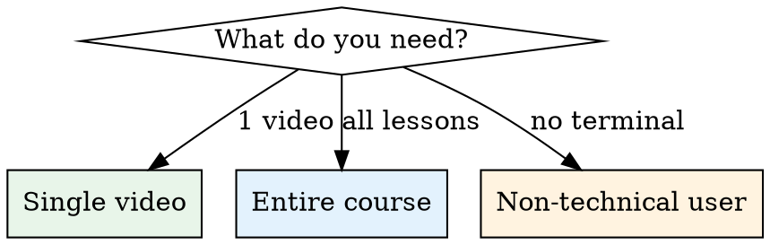

# Skool.com Video & Course Download

## Overview

Skool.com hosts course videos via Loom embeds. Downloading requires extracting video URLs from Next.js page data (`__NEXT_DATA__`), authenticating with exported cookies, and using yt-dlp or wget for the actual download. Three methods exist depending on scope: single video, full course, or browser extension.

## When to Use

- User wants to download one or more videos from a Skool.com classroom
- User wants to archive/backup an entire Skool course locally
- User needs offline access to Skool course content
- **Not for:** Non-Skool platforms (use yt-dlp directly for YouTube, Vimeo, etc.)

## Prerequisites

| Tool | Purpose | Install |
|------|---------|---------|
| yt-dlp | Download videos from extracted URLs | `brew install yt-dlp` / `choco install yt-dlp` / `pip install yt-dlp` |
| wget | Bulk page download for full courses | `brew install wget` / `choco install wget` |
| Get cookies.txt LOCALLY | Chrome extension to export auth cookies | Chrome Web Store |
| VS Code + Live Server | View downloaded HTML courses locally | VS Code extensions |

## Quick Reference: Which Method?



## Method 1: Single Video (Console Script + yt-dlp)

Best for grabbing one video at a time.

**Step 1:** Navigate to the Skool lesson page containing the video.

**Step 2:** Open DevTools → Console (F12 or right-click → Inspect → Console).

**Step 3:** Paste this script to extract the Loom video URL:

```javascript
(function() {
  const params = new URLSearchParams(window.location.search);
  const md = params.get('md');
  if (!md) { console.error('No md= parameter found in URL'); return; }

  const nextData = document.querySelector('#__NEXT_DATA__');
  if (!nextData) { console.error('No __NEXT_DATA__ found'); return; }

  const data = JSON.parse(nextData.textContent);
  const modules = data?.props?.pageProps?.course?.modules || [];

  for (const mod of modules) {
    for (const lesson of (mod.lessons || [])) {
      if (lesson.md === md && lesson.videoLink) {
        console.log('Video URL:', lesson.videoLink);

        const title = lesson.title?.replace(/[^a-zA-Z0-9]/g, '_') || 'video';
        const blob = new Blob([lesson.videoLink], {type: 'text/plain'});
        const a = document.createElement('a');
        a.href = URL.createObjectURL(blob);
        a.download = `loom_${title}.txt`;
        a.click();

        console.log(`Saved as loom_${title}.txt`);
        return;
      }
    }
  }
  console.error('Video not found for this lesson');
})();
```

**Step 4:** Download the video using the extracted Loom URL:

```bash
yt-dlp "https://www.loom.com/share/VIDEO_ID_HERE"
```

### Key Technical Details

- Lesson pages use `?md=HEX_ID` query params to identify content
- Video URLs are stored in `__NEXT_DATA__` JSON under `props.pageProps.course.modules[].lessons[].videoLink`
- Skool uses Loom for video hosting — the extracted URL points to Loom's infrastructure
- yt-dlp natively supports Loom URLs

## Method 2: Full Course Download (wget + cookies)

Best for archiving an entire course with all pages and assets.

**Step 1:** Log into Skool and navigate to the classroom.

**Step 2:** Export cookies using "Get cookies.txt LOCALLY" extension (Netscape format). Save as `cookies.txt`.

**Step 3:** Extract all lesson URLs by running this in the browser console:

```javascript
(function() {
  const links = new Set();
  // Direct links
  document.querySelectorAll('a[href*="md="]').forEach(a => links.add(a.href));
  // Onclick handlers
  document.querySelectorAll('[onclick*="md="]').forEach(el => {
    const match = el.getAttribute('onclick').match(/https?:\/\/[^'"]+md=[^'"]+/);
    if (match) links.add(match[0]);
  });
  // Data attributes
  document.querySelectorAll('[data-href*="md="]').forEach(el => links.add(el.dataset.href));
  // Page source regex fallback
  const sourceMatches = document.documentElement.innerHTML.match(/https?:\/\/[^"'\s]+md=[a-f0-9]+/g);
  if (sourceMatches) sourceMatches.forEach(url => links.add(url));

  const text = [...links].join('\n');
  const blob = new Blob([text], {type: 'text/plain'});
  const a = document.createElement('a');
  a.href = URL.createObjectURL(blob);
  a.download = 'urls.txt';
  a.click();
  console.log(`Extracted ${links.size} lesson URLs`);
})();
```

**Step 4:** Create a project folder with both files:

```
project/
  cookies.txt
  urls.txt
```

**Step 5:** Run wget from the project folder:

```bash
cd ~/Desktop/project

wget \
  --load-cookies=cookies.txt \
  --input-file=urls.txt \
  --page-requisites \
  --convert-links \
  --recursive \
  --level=5 \
  --wait=2 \
  --no-clobber \
  --adjust-extension \
  --restrict-file-names=windows \
  -e robots=off \
  --directory-prefix=course_download
```

**Step 6:** View the downloaded course locally using VS Code + Live Server extension.

### wget Flag Reference

| Flag | Purpose |
|------|---------|
| `--load-cookies` | Authenticate with Skool session |
| `--input-file` | Read target URLs from file |
| `--page-requisites` | Download CSS, JS, images |
| `--convert-links` | Fix links for local browsing |
| `--recursive --level=5` | Follow links up to 5 levels deep |
| `--wait=2` | 2-second delay between requests (be polite) |
| `--no-clobber` | Skip already-downloaded files |

## Method 3: Batch Video Download (Console + yt-dlp)

Combines URL extraction with direct video downloading for all course videos.

**Step 1:** Navigate to the classroom page and run in console:

```javascript
(function() {
  const nextData = document.querySelector('#__NEXT_DATA__');
  if (!nextData) { console.error('No __NEXT_DATA__ found'); return; }

  const data = JSON.parse(nextData.textContent);
  const modules = data?.props?.pageProps?.course?.modules || [];
  const videos = [];

  for (const mod of modules) {
    for (const lesson of (mod.lessons || [])) {
      if (lesson.videoLink) {
        videos.push(lesson.videoLink);
      }
    }
  }

  const text = videos.join('\n');
  const blob = new Blob([text], {type: 'text/plain'});
  const a = document.createElement('a');
  a.href = URL.createObjectURL(blob);
  a.download = 'video_urls.txt';
  a.click();
  console.log(`Found ${videos.length} videos`);
})();
```

**Step 2:** Download all videos with yt-dlp:

```bash
yt-dlp -a video_urls.txt -o "%(title)s.%(ext)s"
```

## Common Mistakes

| Mistake | Fix |
|---------|-----|
| Cookies expired mid-download | Re-export cookies before large batch jobs |
| Running wget without cookies | Always `--load-cookies` — Skool requires auth |
| Console script finds 0 URLs | Make sure you're on the **classroom page** (course listing), not a single lesson |
| yt-dlp fails on Loom URL | Update yt-dlp: `yt-dlp -U` — Loom extractor changes frequently |
| `__NEXT_DATA__` not found | Skool may have updated their frontend — check if the script tag ID changed |
| wget downloads HTML instead of video | wget grabs pages, not video streams — use Method 1 or 3 for actual video files |

## Windows-Specific Notes

- Use `choco install yt-dlp wget` or `winget` for tool installation
- Replace `~/Desktop/project` with `%USERPROFILE%\Desktop\project`
- wget on Windows: use `--restrict-file-names=windows` to avoid illegal filename chars
- PowerShell alternative to cd: `Set-Location "$env:USERPROFILE\Desktop\project"`
